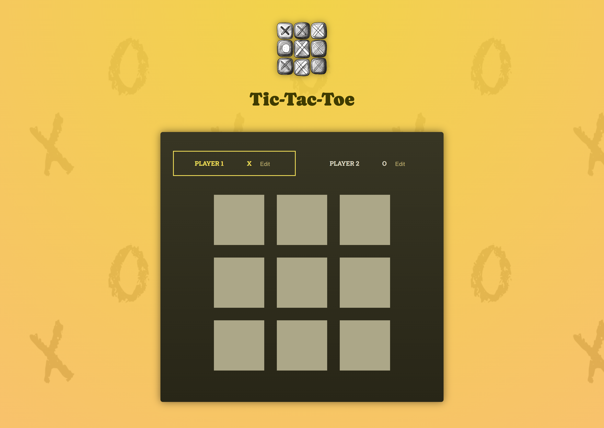

# React Tic-Tac-Toe

A modern implementation of the classic Tic-Tac-Toe game built with React and Vite.



## Features

- 🎮 Interactive gameplay for two players
- 📝 Editable player names
- 🔄 Game state tracking and move history
- 🏆 Automatic winner detection
- 🎨 Attractive animations and styling
- 📱 Responsive design

## Technologies Used

- React 19 - A powerful JavaScript library for building user interfaces
- Vite 4 - Next generation frontend build tool with exceptional performance
- CSS3 with animations - For styling and smooth visual transitions
- Modern JavaScript (ES6+) - Utilizing the latest JavaScript features for clean code

## Getting Started

### Prerequisites

- Node.js (v14 or higher)
- npm or yarn

### Installation and Setup

1. Clone the repository to your local machine
```sh
git clone https://github.com/yourusername/tic-tac-toe.git
cd tic-tac-toe
```

2. Install all required dependencies using npm or yarn
```sh
npm install
# or using yarn
yarn install
```

3. Start the local development server
```sh
npm run dev
# or using yarn
yarn dev
```

4. Access the game in your browser
- Open http://localhost:5173
- The game will automatically reload if you make any changes to the source code

## Game Instructions

1. Gameplay Basics
   - Two players take turns placing their symbols (X or O) on the board
   - Click any empty square to place your symbol
   - First player to get 3 in a row (horizontal, vertical, or diagonal) wins

2. Player Customization
   - Click the "Edit" button next to each player name to customize it
   - Names will be saved for the current session

3. Game Features
   - Automatic win detection
   - Draw detection when no more moves are possible
   - Click "Rematch" for a new game without resetting names
   - Responsive design works on both desktop and mobile devices

## Project Structure

```
tic-tac-toe/
├── public/								# Static assets
├── src/
│   ├── components/						# React components
│   ├── assets/							# Images and other assets
│   ├── App.jsx							# Main application component
│   └── index.jsx						# Application entry point
├── index.html							# HTML template
└── package.json						# Project dependencies and scripts
```

## Build

To create a production build:

```sh
npm run build
```

The built files will be in the `dist` directory.

## Acknowledgments

- Built as part of a React learning journey
- Inspired by the classic Tic-Tac-Toe game